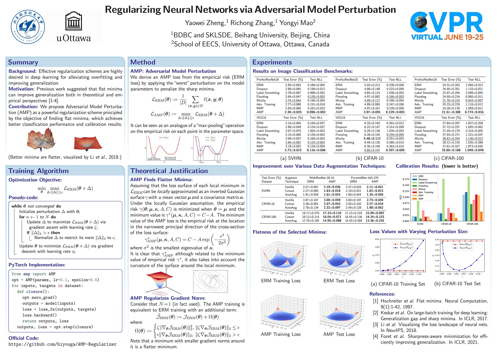
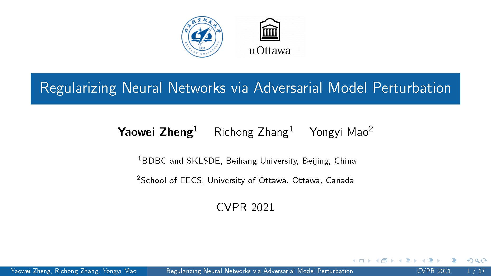

# LaTeX Poster and Slides for AMP (CVPR 2021)
## Poster Example

## Slides Example

## Acknowledgement

This code contains the LaTeX source code for the poster and slides for AMP (CVPR 2021). The poster is created based on the [Chen's](https://github.com/guanyingc/SDPS-Net_Poster_LaTex) awesome project and the [LaTeX Poster Template](http://www.brian-amberg.de/uni/poster/). The slides are created based on the beamer package.

## Reference

- [TOM-Net_Poster_LaTex](https://github.com/guanyingc/TOM-Net_Poster_LaTex)
- [SDPS-Net_Poster_LaTex](https://github.com/guanyingc/SDPS-Net_Poster_LaTex)
